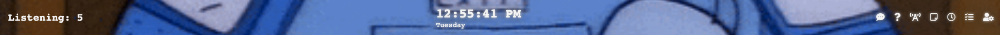
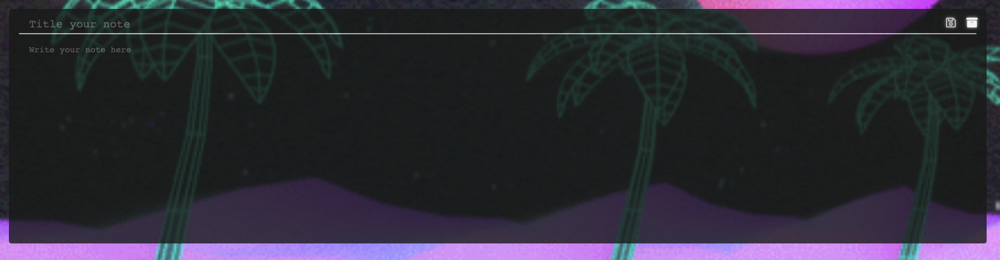
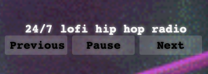
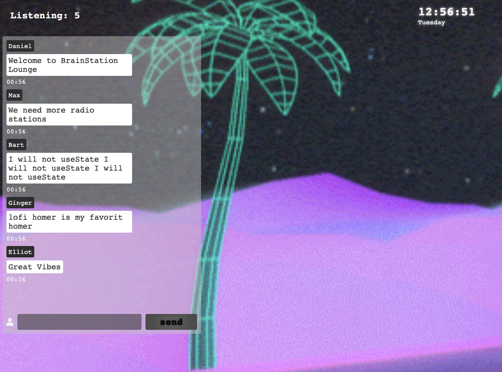

# BrainStation Lounge

An open source collaborative project where students are incouraged to make pull requests, add unique features, and collaborate with former/currents BrainStation students.

## Features

#### Notes

- create/save/delete/update notes

#### Timer

- Pomodoro/regular
- customizable

#### Live Radio

- Spotify
  - oauth needed
- Youtube live radio

#### Chat ("Live")

- display name and time sent
- activity monitor (i.e. _daniel_ is working on bandsite-sprint-3)
- chat with other students in the lounge

#### Programming tips

- across screen slideshow
- links to get more info

#### Slack

- Oauth Needed
- Show Announcement chat
